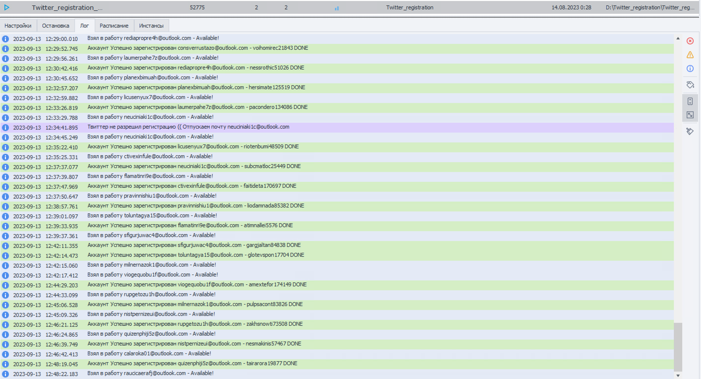

# Регистратор аккаунтов Twitter на запросах (Шаблон Zennoposter)
 
Шаблон Zennoposter регистрирует аккаунты в Twitter.
В шаблоне предусмотрен выбор настроек на все важные элементы.
В случае какой-либо ошибки, вся информация возвращается по файлам и папкам.

## Особенности регистратора аккаунтов Twitter:
* перед регистрацией проверка доступности почты по imap
* проверка на повторную регистрацию на один и тот же имеил
* для регистрации не нужны sms!!!
* подтверждение почты
* работа через прокси
* многопоток
* имитация реального человека
* подключен сервис гадания капчи rucapcha

## На выходе, по окончанию регистрации можно выбрать формат выдачи результатов
* файл в следующем виде - login_twitter:pass_twitter:auth_token;token_twitter:ct0;ct0_token:login_email:pass_email
* или и файл и профили Zennoposter

Вы получаете закрытый шаблон, привязанный на вашу почту.
Если у вас нет Zennoposter, то мы можем выписать вам шаблон на ZennoBOX. Стоит дополнительно 15 долларов.

В случае каких либо ошибок, мы оперативно исправляем их.
Так же перед покупкой, мы можем подредактировать шаблон по ваши требования.
Купившим шаблон Zennoposter сейчас, все обновления предоставляются бесплатно на период подпиcки.

Есть разные варианты подписки 1 месяц (50$), 6 месяцев(150$), 12 месяцев(250$)

Время создания одного аккаунта: 2-10 минут. Это зависит от скорости разгадывания капчи сервисом rucapcha.
Можно запускать хоть в 100 потоков(в ZennoBOX ограничение 20 на все проекты) - шаблон работает на запросах - потребление ресурсов минимальное!

## Купить регистратор аккаунтов Twitter вы можете обратившись по контактам ниже:

## Telegram: @AlexKravchenko88 или https://t.me/AlexKravchenko88

---------------------------------------------------------------------------------------------------

# Twitter Account Registrar on Queries (Zennoposter Template)
 

 

The Zennoposter template registers Twitter accounts.
The template provides a choice of settings for all important elements.
In case of any error, all information is returned by files and folders.

## Twitter account recorder features:
* before registration, check the availability of mail by imap
* check for re-registration on the same email
*SMS is not required for registration!!!
* mail confirmation
* work through a proxy
* multithread
* imitation of a real person
* rucapcha captcha divination service is connected

## At the exit, at the end of registration, you can choose the format for issuing results
* file in the following form - login_twitter:pass_twitter:auth_token;token_twitter:ct0;ct0_token:login_email:pass_email
* or both file and Zennoposter profiles

You receive a closed template linked to your mail.
If you do not have Zennoposter, then we can order a template for you on ZennoBOX. Costs an extra $15.

In case of any errors, we promptly correct them.
Also, before buying, we can edit the template according to your requirements.
If you buy the Zennoposter template now, all updates are free for the subscription period.

There are different subscription options 1 month ($50), 6 months ($150), 12 months ($250)

Time to create one account: 2-10 minutes. It depends on the speed of captcha solving by rucapcha service.
You can run at least 100 threads(ZennoBOX has a limit of 20 for all projects) - the template works on requests - the resource consumption is minimal!

## You can buy a Twitter account registrar by contacting the contacts below:

## Telegram: @AlexKravchenko88 or https://t.me/AlexKravchenko88

## Screenshots

